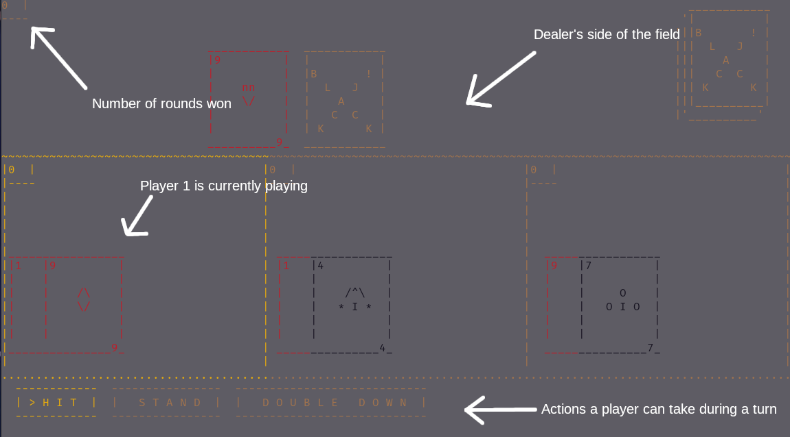
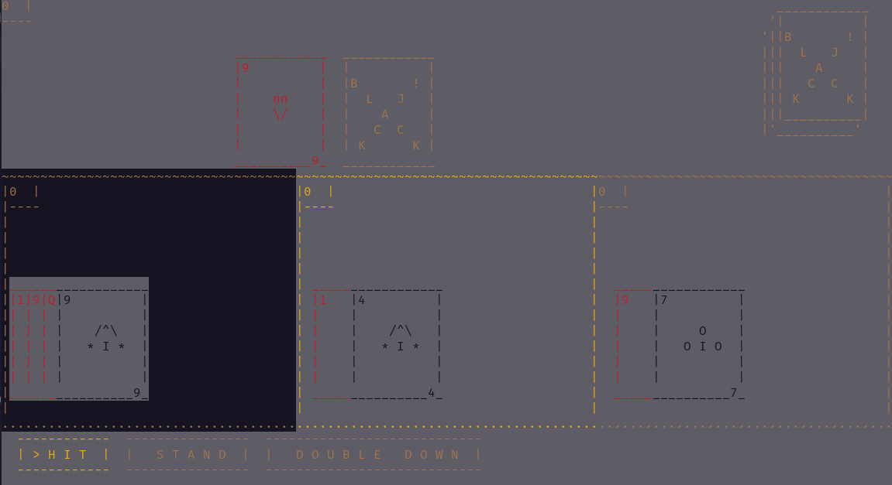
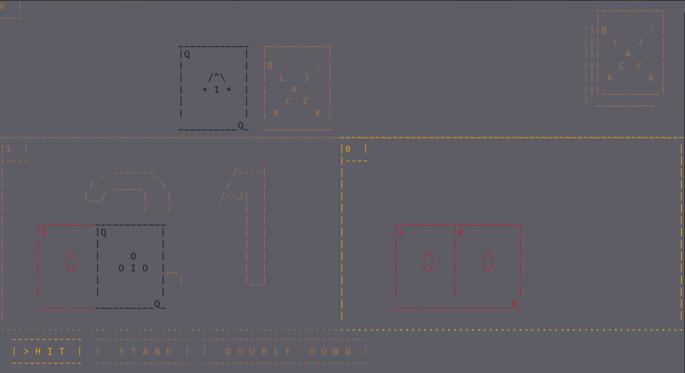
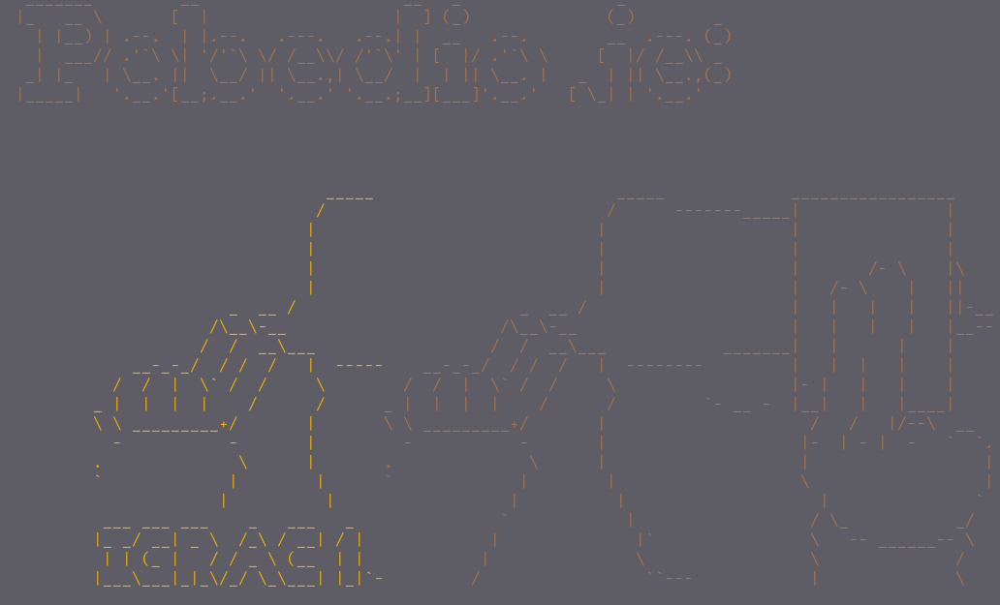

# ASCII Blackjack
ASCII blackjack game written in masm x86 assembly code. Literal school project.

This project is made by students:
 - Lazar Šponja 18/296
 - Milica Bokčić 18/35

## About the game
The game is a simplified version of blackjack, where the objective is to win most rounds by having a score as close as possible to 21 *(but not exceding 21)*. When you're sick of playing, press ESC and the game will choose the player with the max points and display them as the victor.

<span class="img_container center" style="display: block;">
    
    <span class="img_caption" style="display: block; text-align: center;"><em>Figure 1: Gameplay</em></span>
</span>

The actions the player can take during a turn *(hit, stand, double down)*, are equivalent to a regular game of blackjack. *(hit gives you a card, stand ends turn, double down gives you a card and ends the turn, but winning that turn gives double points)*

<span class="img_container center" style="display: block;">
    
    <span class="img_caption" style="display: block; text-align: center;"><em>Figure 2:Player 1 busted</em></span>
</span>

When a player busts, the game colors that player's table black. This helps make the game more enjoyable as it makes it quite easy to see which players lost that round.

<span class="img_container center" style="display: block;">
    
    <span class="img_caption" style="display: block; text-align: center;"><em>Figure 3:Player 1 got a blackjack</em></span>
</span>

Similarly, a player that got a 21 will have their a little 21 graphic drawn on their table.


<span class="img_container center" style="display: block;">
    
    <span class="img_caption" style="display: block; text-align: center;"><em>Figure 4: Victory screen</em></span>
</span>

If you press ESC during gameplay, the game stops and displays a variant of the screen above for 5 seconds, then the game restarts. 

A few rules for assigning victory should be noted:

1. If multiple players have the same ammount of points when the game is quit, the the victory screen will display all of the tied players as victors

2. Similarly, if multiple players tie in a single round, all of them will be awarded points

3. If a dealer and the player tie in a single round, the player will be awarded the point over the dealer

4. But if the dealer and the player are tied when the game is quit, the dealer is considered to winner, to keep it fair to the dealer

## Additional notices
The game uses the [irvine32 library](https://github.com/Eazybright/Irvine32), and can be compiled with masm 6.14 with wine on linux.  

The game consists conists of series of functions which react to player input, either by updating ui elemets or handling the game logic

# Assembling
## Prerequisites
To assemble the game, you need the [irvine32 library](https://github.com/Eazybright/Irvine32), and some version of masm.

If you're assembling the game manually on windows, it is recommended that you get [visual studio build tools](https://visualstudio.microsoft.com/downloads/#build-tools-for-visual-studio-2019) and call `ml.exe` directly from it's developer console, but any version of masm should work. 

The project comes with premade [vscode](https://code.visualstudio.com/) build tasks and debug tasks for automating the assembly of code. This requires you to launch vscode from the visual studio developer console, as the build tools do not add `ml.exe`, `link.exe` nor the standard windows libraries to `$Env:PATH`. It also requires the [C/C++ plugin](https://marketplace.visualstudio.com/items?itemName=ms-vscode.cpptools) for the use of the debugger. Optionally, but recommended is the [ASM Code Lens plugio](https://marketplace.visualstudio.com/items?itemName=maziac.asm-code-lens) for syntax highlighting. 

Another way to auto assemble the code is to just get [visual studio](https://visualstudio.microsoft.com/), as it just works. This option is not recommended as visual studio is a bit overkill for such a simple project.

## Building on windows
This assumes you are using visual studio build tools

1. Launch the developer console and change into the directory with your .asm file
2. Run the following command:
```console
ml /Sg /FoBlackjack.obj /I "c:\Irvine" /W3 /TaBlackjack.asm /link /OUT:Blackjack.exe /LIBPATH:c:\Irvine user32.lib irvine32.lib kernel32.lib /SUBSYSTEM:CONSOLE /DYNAMICBASE:NO /MACHINE:X86 /SAFESEH:NO
``` 

That's it! You can now play some ascii blackjack!

If for some reason you want to debug the game, you need to complie the game with the following command:

```console
ml /Sg /Zi /FoBlackjack.obj /I "c:\Irvine" /W3 /Blackjack.asm /link /OUT:Blackjack.exe /LIBPATH:c:\Irvine user32.lib irvine32.lib kernel32.lib odbccp32.lib /DEBUG /PDB:Blackjack.pdb /SUBSYSTEM:CONSOLE /DYNAMICBASE:NO /MACHINE:X86 /SAFESEH:NO 
```

## Building on linux
The procedure for building for linux is largly the same, you just ran masm under wine. The following article will give a detailed explaination on how to run masm under wine:

>  [Using MASM on Mac or Linux via Wine](https://reberhardt.com/blog/programming/2016/01/30/masm-on-mac-or-linux.html) 

# Game Breakdown
Most functions are functions dedicated to the "fancy" graphics you see on the terminal, while main mostly handles the game logic based on player input 

A cursory explanation of the functions in the code can be found below. Functions use registers for arguments.
## `DrawSprite(dx:position, ebx:addr_of_sprite)`
The fuctions takes two arguments, position and address in memory of the sprite to draw on screen.

The function does this by repeated calls to `GotoXY()` and `WriteString()` from the [irvine32 library](https://github.com/Eazybright/Irvine32)

## `DrawCard(dx:position, bl:card_index)`
This function takes two arguments, position and card number *(from 0 to 51)*. 

The function decodes the color and number of the card based on it's index by first doing mod 4 operation to figure out the color of the card, and then it calls `DrawSprite()` to draw the card with the decoded symbol at the specified position.

Then the function figures out the card number by integer diving the index by 4, then drawing the number on the corners of the card. 

Special index numbers are 52 and 53. These are used for card animations
- 52 tells the function to draw the back of the card
- 53 skips drawing and saves coordinates to *KoordinatePraznogPolja*

## `NacrtajKarteIgraca(esi:player_ptr)`
This function draws cards that the player has in hand by calculating the number of rows that can fit on the player's table, then does the following:
- Moves up 2 times the number of cards rows up and $n$ times half a card widths to the left
- Draws cards in a row card by card until it hit the max number of cards per row *(max number of cards per row is a variable in the `IgracUOkruzenju` struct whose value get's initalized in main based on how many player are active at a time)*
- Drops by 4 and draws another row. It repeats this until the player runs out of cards

There are a few exceptions to these rules, such as:
- When moving back, $n$ cards widths, if the edge of the table has been reached, cards will start to be drawn denser, as the cursor will move less to the right when drawing the rest of the cards in order to fit in the row


## `DrawBackground()`
This function draws the background sprites like the dealer and his deck, and player boxes in various states, such as busted, won or got a 21. 

The function first draws all the players except the player whose turn it currently is, then that player so that player would have their broder selected.

## `UpdatePlayFrame()`
This function calls `DrawBackground()`, then calls `NacrtajKarteIgraca()`for each player. Basically, updates the current screen. It also sets the text color to default. 

It doesn't refresh the buttons.

## `DajAdresuFlipSprajta(bl:card_type)`
This function moves the address of a flipped card sprite based on the current value in `bl`. 

| `bl` value  | Card type |
|:-----------:|:---------:|
|      0      |  Diamond  |
|      1      |   Clove   |
|      2      |   Heart   |
|      3      |   Spade   |

## `ClearScreenFaster()`
This function writes a blank string over the entire screen to effectively clear it. It is much faster then the `Clrscr()` form the [irvine32 library](https://github.com/Eazybright/Irvine32), and the game doesn't care if the frame buffer as invisible characters on screen or no characters on screen

## `DrawNubbins(al:n_buttons, esi:button_array_ptr)`
This function draws all the on screen buttons. It checks which one is the currently selected one *(it checks the SelectedButton variable)* and draws the selected button yellow with the '>' symbol

This function doesn't care which buttons it draws, as long as `esi` points to an array of `Dugme` structs, the function will draw all the buttons, making it usable for both the player select screen and handling gameplay buttons

## `DrawGameplayNubbins()`
This preps `DrawNubbins` to draw the gameplay buttions. Can be a macro too but this is potentially more memory efficient.

## `UpdateBrojIgracaMeni()`
This preps `DrawNubbins` to draw the player select buttions. It also draws the player graphic based on the highlighted button. 

## `PustiAnimacijuKarte(al:card_index, ah:anim_type)`
This function hold 4 different types of animations that get played when dealing cards

1. The card is flipping at it travels to the player
2. The card first flips, then travels to the player
3. The card is moving face-down 
4. The card that is facedown flips

All animations, except the 4th one, calculate a vector form `KoordinateSpilaKarata`, a memory location representing the location of the deck, to `KoordinatePraznogPolja`, a memory location representing the coordinates of where the card will end up being *(this memory location is set by `DrawCard(bl:53)`)*. This vector is then divided by 4 in order to make 4 frame moves from deck to 

## `DodajKartuIgracu(ebx:current_player, al:card_index, ah:animation_type)`
This function calls `PustiAnimacijuKarte()`, draws the the new card on th screen and finally updates that players `pointCount` and `Flags`.

## `Main()`
Main is almost singlehandedly responsible for handling initializing the game, reading player inputs and handling the logic.

The very first thing it does is initialize all the possible buttons the game has. *(start, player select, hit, stand, double down)*.

The game then wait's for the player to press enter to start the game, after that it draws the player select screen and start capturing the player inputs the display which button and the player select screen is supposed to be higlighted, and whether ENTER has been pressed on that key to start the game

After that the game clears the screen and initializes the number of players depending on the option chosen in the previous menu.

Next is when the round proper starts. The game first deals two cards to each player and the dealer, with the dealers 2nd card being dealt facedown. During dealing the inital two cards the gameplay buttons are disabled, and the value of the cards the players got is added to their `pointCount` and their `flags` are updated appropriately.

After that the buttons become active, during which keyboard input is captured to see which button is selected and/or pressed. 

Pressing the hit button will give the player a card, play the appropriate animations, update points and flags and let the player play again, until the bust, which ends their turn

Pressing the stand button will check if the player has a an ace in their hand, add 10 to their point count if they do and then end the players turn

Pressing the double down button will give the player a card, check if they have and ace and if they do add a 10, set the doubledown flag and end their turn.

After every player ends their turn, the dealer can play. The dealer is more or less just forced to hit until the dealer has the most points or until the dealer busts. 

At the end of the dealers turn, the game checks who has the most points and awards them a win. Then the game resets all player variables, except wins, and starts the turn again.

If ESC is pressed, the game will wait until all the players recieve their starting hand, then it'll calculate who has the most points, display their victory screen, clear all player variables, wait 5 seconds, and start the game over from the start screen

The game has no quit button, you're stuck playing eternally. That is what you get for gambling. 
